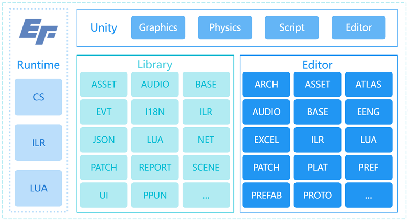

# EF.U3D
A LITE U3D-BASED FRAMEWORK.

## SUMMARY | 功能概述

## MANUAL | 使用手册
### 安装软件
- Unity Hub(Required): https://unity.com/download
- Unity 2021.3.30f1(Required): [unityhub://2021.3.30f1/b4360d7cdac4](unityhub://2021.3.30f1/b4360d7cdac4)  
- Visual Studio 2022/2019(Required): https://visualstudio.microsoft.com/zh-hansvs
- Visual Studio Code(Required): https://code.visualstudio.com
- TexturePacker(Required): https://www.codeandweb.com/texturepacker/download
- WinRAR(Required): http://www.winrar.com.cn/index.htm
- Everything(Optional): https://www.voidtools.com/zh-cn
- Notepad++(Optional): https://soft.eframework.cn/NPP.8.4.2.exe
- BeyondCompare(Optional): https://soft.eframework.cn/BC.3.3.12.exe
- UGit(Required): https://ugit.qq.com
  - 注册工蜂: https://git.code.tencent.com
    - 微信登录/注册
    - 初始化账号: **姓名小写全拼**
  - 配置软件:
    - UGit软件 > 设置 > 账户 > git.code.tencent.com > 授权登录
- SetEnv(Required): https://soft.eframework.cn/SetEnv.cmd
  - 运行该命令以自动配置系统环境变量（TexturePacker & WinRAR）或手动设置

## FAQ | 常见问题

## TODO | 待办事项

## REFER | 引用说明

## LICENSE | 许可声明
- Copyright (C) EFramework, https://eframework.cn, All rights reserved.
- **SEE [LICENSE.md](https://u3d.eframework.cn/md_LICENSE.html) FOR MORE DETAILS.**

## CHANGELOG | 更新日志
### 2023.9.24 - 
- 修复Rebuild ILR Component异常（.unity）
- 优化Excel生成规则（敏感字符转义）
- 优化Proto生成规则（支持单行注释）
- 重构Excel和Proto的命名空间

### 2023.8.8 - 2023.9.23
- 修复ILR/I18N/OBJREFER等组件序列化问题
- 修复关闭应用时网络异常（网络输出线程优化）
- 修复网络多线程收发包线程锁异常
- 修复资源变体移除异常
- 修复资源引用计数器添加异常
- 修复推送资源路径包含空格异常问题
- 修复批处理多平台/首选项应用异常
- 修复事件通知时解注册异常
- 修复更新管理器依赖资源卸载异常
- 修复更新管理器解析整型参数异常
- 修复跨平台编译闪退问题
- 修复滚动视图快速滑动引起的显示异常
- 修复文件清单解析错误引起的资源推送异常
- 修复AB构建时材质/着色器变体生成异常
- 修复事件对象池回收逻辑错误
- 修复Reporter多实例（2D/3D）切换异常
- 修复网络输出缓冲区阻塞异常
- 修复PB序列化数组越界问题
- 修复下载大文件显示异常
- 优化网络EncodePB逻辑（支持pb对象obtain）
- 优化Reporter日志显示（避免卡顿）
- 优化UIHelper.Add/Get/RemoveComponent函数（增加类型判断，避免闪退）
- 优化安装包/补丁包构建流程（Debug模式使用EditorBuildSettings构建选项）
- 优化大安装包/补丁包推送流程
- 优化资源依赖生成流程
- 优化补丁推送及下载流程
- 优化音效管理器相关接口
- 优化Reporter面板显示
- 优化SceneManager.Goto接口（不再判断是否当前场景）
- 优化编辑器标题显示（渠道/版本/首选项/分支）
- 优化AssetManager.LoadScene/Async接口（支持场景路径及设置加载模式）
- 优化物理函数回调
- 优化网络连接心跳（内置）
- 优化自动释放场景/资源
- 优化ILR环境下Excel读取产生的大量GC
- 重构ILR跨域继承逻辑
- 重构ILR序列化Shadow逻辑
- 重构I18N为I18NApi（避免与.NET核心库冲突）
- 重构Excel字段访问形式为属性
- 新增宏EFRAME_MERGE_SCENE_MAT以控制是否合并场景引用的材质
- 移除Bundle Patch（打包资源）流程

### 2023.7.1 - 2023.8.7
- 修复音乐播放/停止功能异常
- 修复构建UUID日志输出异常
- 修复日志面板复选按钮逻辑异常及日志内存默认值大小
- 优化I18N资源处理器
- 优化ILRBindings生成（保持类型引用，避免被剔除）
- 优化网络输入/输出流（多线程，高并发）
- 优化热更新流程日志
- 优化2G大文件（安装包/补丁包）推送
- 优化编辑器Zip函数（支持2G裁切）
- 优化资源标签设置（截取超80字符路径）
- 优化移除缺失脚本工作流（支持多文件选择）
- 重构protobuf的encode/decode/size接口（无GC）及代码生成工具
- 重构UI界面缓存逻辑（不缓存/场景缓存/全局缓存）
- 重构ILR序列化/反序列化功能
- 重构ScriptBundle和AssetBundle逻辑
- 重构共享（缓存）事件
- 新增构建回退流程
- 新增资源变体流程
- 新增资源引用流程
- 新增资源回退流程
- 新增ILR脚本导入流程（新增宏#if UNITY_EDITOR || !EFRAME_ILR）
- 新增编辑器标题显示Git分支名称（优化多人协作流程）
- 新增AB自动引用计数及内存释放
- 移除protobuf-net
- 移除ILR组件isEnabled字段
- 移除Shader资源处理器

### 2023.6.12 - 2023.6.30
- 修复Loom相关接口异常
- 新增EFRAME_NO_MERGEAB以控制是否合并游离的原始AB包
- 新增ProcUnicode以限制包含中文的文件（夹）
- 新增Preferences.UUID字段校验安装包的唯一性
- 新增Android/Windows构建符号表工作流
- 优化Reporter状态条显示（LIVE_MODE隐藏和2D模式位置限制）
- 优化内置补丁包的解压速度
- 优化构建时工程配置的备份还原逻辑

### 2023.5.9 - 2023.6.11
- 修复若干批处理构建相关问题
- 修复ILR构建异常（特殊路径）
- 修复ILR枚举序列化问题
- 修复Protobuf解析异常（非ILR模式）
- 修复NetConnection断线重连异常
- 新增UDP网络协议支持
- 新增H5（WebGL）工作流支持
- 优化Reporter内存占用及卡顿
- 优化Reporter中2D窗口自适应
- 优化Prefs和Plat文件路径及读取方式
- 优化Prefs文件（同步的）保存工作流
- 优化测试模式下Patch/Conn/Cgi可配置
- 优化AssetBundle构建逻辑

### 2023.4.29 - 2023.5.8
- 修复跨平台构建异常
- 修复灯光贴图文件路径归一化异常
- 修复ILR构建异常
- 新增快捷构建面板批量构建功能
- 新增批处理模式构建入口（Jenkins）
- 新增多语言Text组件转TMP功能
- 优化构建事件监听

### 2023.4.21 - 2023.4.28
- 修复清除空目录功能异常
- 修复AssetBundle打包一致性问题
- 新增Default/Android构建管线
- 优化构建流程，删除Android/Windows平台的符号文件
- 优化多语言功能

### 2023.4.17 - 2023.4.20
- 修复WinArch安装APK异常
- 修复LogServer字段读取错误
- 修复多平台配置切换编辑器问题
- 修复NET和EVT使用Enum类型传递事件ID在ILR/LUA平台引起的异常
- 优化NET模块，公开若干网络状态事件
- 优化I18N工作流（支持禁用/清理/重序列化I18N组件）
- 新增清理无效资源功能（Assets/EFrame/Remove Useless Assets）
- 新增清理空目录功能（Assets/EFrame/Clear Empty Directory）
- 新增灯光贴图目录归一化功能

### 2023.4.15 - 2023.4.16
- 修复Windows平台Build Patch目标错误问题（StandaloneWindows64/StandaloneWindows）
- 优化资源构建流程，使用LZ4提升加载速度
- 优化二进制包构建流程，处理异常情形
- 优化快捷构建面板内容排序方式
- 优化多平台设置工作流，支持调整子项顺序以改变首选项

### 2023.3.25 - 2023.4.14
- 修复Reporter状态面板超出屏幕问题
- 优化推送资源流程，剔除.manifest文件
- 优化构建资源流程，加速shader编译
- 优化资源标签逻辑，支持设置以文件/文件夹名称
- 优化二进制包构建流程，提高构建速度
- 优化快捷构建面板内容排序方式
- 重构资源工作流程，提升开发速度
- 完善若干编辑器接口文档

### 2023.2.19 - 2023.3.24
- 修复ILR序列化自定义类/枚举异常问题
- 优化Reveal Manual（查看文档）功能

### 2023.2.6 - 2023.2.18
- 修复空字节数组引起的FileManifest.Load异常问题
- 修复TexturePacker打包图集边缘1个像素重合问题
- 修复模块内注册事件类型转换错误
- 修复应用程序关闭导致ILR文件流异常
- 修复从构建面板打开多平台设置界面显示异常
- 修复推送补丁包/安装包剩余时间显示异常
- 优化从ILRComponent域内"启动/停止"协程接口
- 优化模拟器替换流程(EFrame/Simulator/Select)
- 优化编辑器模式下内置包解压流程，避免全量下载资源

### 2023.2.1 - 2023.2.5
- 新增移除预制/场景中丢失的脚本功能（Remove Missing Scripts）
- 新增UIRoundRawImage圆形图片组件
- 新增SetAlpha、SetSpriteRes、SetSpriteName等拓展方法
- 修复ILR组件HideInInspector字段序列化失败
- 优化事件ID，支持枚举参数
- 优化ILR组件重序列化功能，支持单选/多选/所有资源进行操作
- 优化AddComponent接口，新增attachIfMissing参数（若未找到则挂载）

### 2023.1.19 - 2023.1.31
- 完善依赖库和运行时的在线文档
- 完善若干编辑器代码注释
- 修复NetManager.SendMsg接口二义性问题
- 修复Constants.RUNTIME_NAME问题（Unity 2021）
- 修复场景中引用预制，ILR组件字符覆盖序列化失败的问题
- 优化FileManifest下载代码（WWW->UnityWebRequest）

### 2023.1.13 - 2023.1.18
- 完善底层框架接口注释
- 修复创建图集警告问题
- 修复UI包若干警告问题，新增若干针对Transform的拓展（EachChild等）
- 修复构建AssetBundle时工作空间错误问题（导致重编、严重）
- 修复多平台切换的显示问题
- 优化推送补丁包/安装包的进度显示（二阶段：推送中、解压中）
- 优化NetManager/Modulize->SendMsg/SendCgi，支持发送空包
- 新增UIHelper.SetSpriteRes，用于动态加载Sprite精灵并赋值给Image对象

### 2023.1.6 - 2023.1.12
- 优化Excel导表工具，剔除多余的空行以及字段合法性校验
- 优化UIWrapContent布局（横向/纵向，列表/网格），新增Space设置间隔、EachItem接口遍历显示列表
- 修复ILRComponent反序列父类私有/受保护字段问题
- 修复UnityWebRequest内存泄露问题（A Native Collection has not been disposed...）

### 2022.12.20 - 2023.1.5
- 优化ILRComponent生命周期Update/LateUpdate/FixedUpdate
- 优化图集/预制/场景编辑器的搜索记录
- 新增了快速构建编辑器